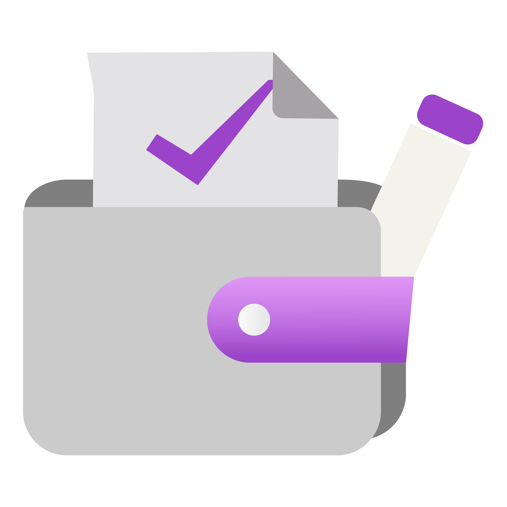

#  PLOG

I built PLOG to help manage my finances in a way that felt intentional, private, and easy.  
PLOG works as a manual ledger where the user can create different account types such as cash or debit accounts and transfer funds between them (when they share the same currency).  
All transactions are manually entered instead of connecting to a bank or third-party service. This means that every balance exists because the user recorded it.  
  
Transactions are grouped by day with a running total shown at the top which makes it easy to see how much has been made/spent.  
PLOG can track subscriptions in a separate module which integrates with the Ledger. The user sees the next due date, amount, and the account a subscription will be paid from.  
PLOG highlights subscriptions that are coming up or overdue so nothing slips by unnoticed. Marking a subscription as 'Paid' also adds the transaction to the Ledger automatically.  
(Ledger Transaction -> Subscription is planned) 

I created this because I wanted something simple, private, and free. 
If this app helps someone (or anyone) else, that's amazing, but it's primarily built for my own financial clarity.

## Screenshots

  

- The screenshot above shows the default empty state when the app is first opened.

## Personal Roadmap

This project is changing as my financial needs change.  
If you build/download a release - a future version will more than likely have breaking changes so please bear this in mind.  

### Planned areas of development include:

- Tests
- Improved recurring and subscription handling
- Clearer asset and liability separation
- Budgeting module development
- Investment tracking for traditional assets
- Crypto account support
- Foreign exchange support for multi currency accounts

## Development Approach

This app is built with the support of modern AI tooling.

If AI assisted development is a *big* concern for you, feel free to review the code and suggest the **many improvements** it no doubt has.  
Refactors and thoughtful feedback are always welcome.

## Expectations

This is a personal project. It may change frequently. Features may evolve or be refactored as the architecture matures. I may take extended breaks from development. Good luck!
